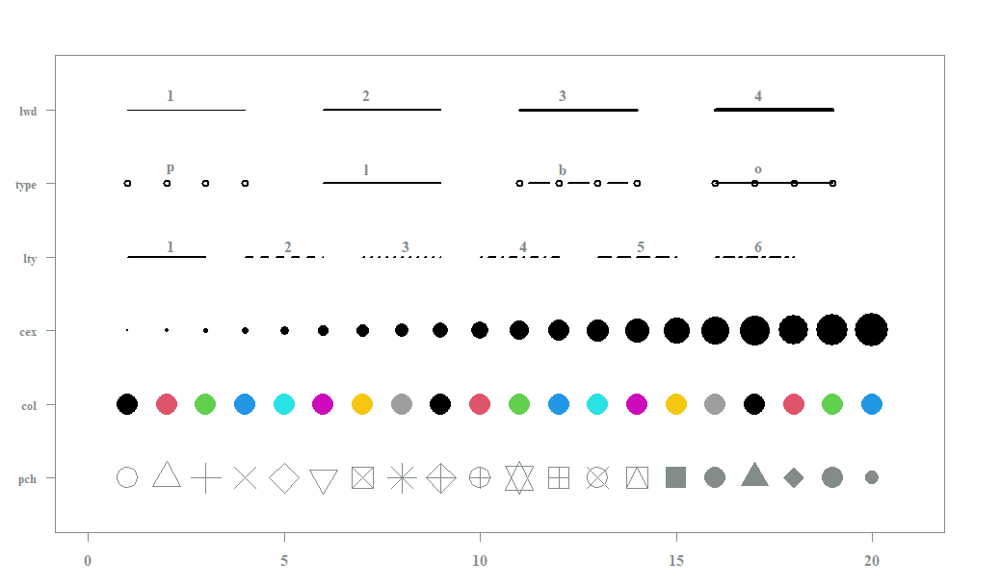
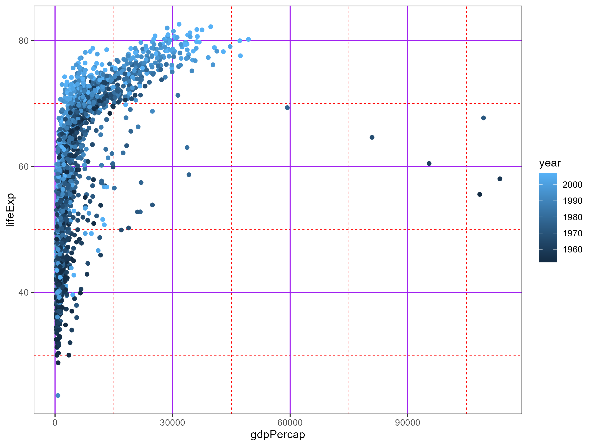

```{r setup, include=FALSE}
## Global options
knitr::opts_chunk$set(cache = TRUE)
library(tidyverse)

```

# Data

There are many functions and formats that can be used to process and store data within R. While all things can be done using the basic R functions, packages or libraries have been developed to make things easier. As this is often happens by one person (or group) creating a function they need, and then developing that into a package, they do not always agree on how things should be done.

Another complication is that programmers and data scientist pick up habits and "go-to" packages to perform specific tasks. This means that each task can be solved in many ways. I will attempt to stay within the **tidyverse** in these workshops and will update the analyses scripts to depend on the **tidyverse** as well.

[**Tidyverse**](https://tidyr.tidyverse.org/) is an an opinionated collection of R packages designed for data science. All packages share an underlying design philosophy, grammar, and data structures.

## Clean data

Before data can be imported into R it will many times be necessary to ensure that the data i formatted appropriately before doing the actual import.

There are some general rules to keep in mind when preparing data:

1.  **Columns cannot begin with a number**\
    If the first character in any column name is numeric R will automatically add an "X" to the name
2.  **Special characters will be replaced with "."**\
    Column names can only consist of alphanumeric characters (a-z, A-Z, and 0-9) and "\_". Any other character will be replaced with a period.
3.  **Rows and columns will be swapped**\
    Even though a row.name may begin with a number, if a table is transposed an "X" will be added and mean that row.names does not match if data is transposed once more.
4.  **R is case sensitive**\
    It can sometime be easier to "fix" such case differences before loading it into R, else use the functions `tolower()` or `toupper()`.

## Import data

There are several ways to get data into R. We will use the package **readr** ([cheatsheet](https://raw.githubusercontent.com/rstudio/cheatsheets/main/data-import.pdf)). The **readr** package is part of the tidyverse, so by loading tidyverse as part of setup, this package is loaded as well. If unsure whether the data will be imported correctly, use the import function (File\>Import Dataset\>From text (readr)). This is the same functions that RStudio uses, which means that when using the import wizard the necessary code to repeat the import is created.

### tibbles

When using **readr** to import data it will be formatted as a tibbles, NOT data.frames. In general this should not make a big difference, but if necessary the format can always be changed using `as.data.frame()`.

Further information about tibbles [**HERE**](https://r4ds.had.co.nz/tibbles.html), this is a chapter in a book (R for Data Science) that covers all parts of doing data science within the [**tidyverse**](https://tidyr.tidyverse.org/) community.

### Exercise

Load the file "sales_data.txt" as "dat", using the import function and paste the code in the field below.

> Remember to ensure that all columns has the correct format.

```{r import, eval=TRUE}


```

For example a danish csv file (with semicolon as delimiter) can be imported with the command `read_csv2("input_file.csv")` while a table in R can be exported using the command `write_csv2("output_file.csv")`. This means that it is very simple to save a table to a file:

`write_csv(dat, "clean_sales.csv")`

## Format data

The specific analysis or plot you want to create might affect how data should be formatted. You could have measured weight over time in a group and the have the columns:

> ID, Weight_1, Weight_2, Weight_3.

Another option would be to have the columns:

> ID, Time, Weight

The first format is generally called **wide** and the latter **long**.

The function `pivot_longer()` changes from wide to long, while `pivot_wider()` changes from long to wide.

```{r pivots, eval=TRUE}
# Create data
dat <- tibble(ID = LETTERS[1:10]) %>% 
  mutate(Weight_1 = rnorm(10, 60, 5), 
         Weight_2 = Weight_1 + rnorm(10, 2, 2), 
         Weight_3 = Weight_2 - rnorm(10, 5, 2))
dat

# create longer format
long <- dat %>% pivot_longer(!ID, names_to = "Time", values_to = "Weight")
long

# create wide format
wide <- long %>% pivot_wider(names_from = "Time", values_from = "Weight")
wide

```

# ggplot2

Plotting in R is very simple, but the syntax is not that intuitive, so we will be using ggplot instead.

Here are some examples of standard plots using base R plotting and ggplot2

```{r base_plot, eval=TRUE}

## Scatter plot 
# Base R plotting
plot(x = airquality$Wind, y = airquality$Ozone,pch=16, main = "Base R plotting")
abline(lm(Ozone~Wind,data=airquality),col='red')

# ggplot2
ggplot(airquality, aes(x = Wind, y = Ozone)) +
  geom_point() + 
  geom_smooth(method='lm') + 
  ggtitle("ggplot2")

## Histogram
# Base R plotting
hist(airquality$Ozone)

# ggplot
ggplot(airquality, aes(x = Ozone)) +
  geom_histogram()

## Boxplot
# Base R plotting
boxplot(Sepal.Length ~ Species, iris, xlab = "Species", ylab = "Sepal length")

# ggplot
ggplot(iris, aes(x = Species, y = Sepal.Length)) +
  geom_boxplot() +
  ylab("Sepal length") + 
  xlab("Species")

```

When creating plots with baseplots many variables are set with a numerical value that just has to be known:



It is also possible to create complex plots with base R plotting, but the code can become very complex

```{r complex_plot, eval=TRUE}
## Complex baseplot
pirates <- read_csv("pirates.csv")
# Create layout matrix
layout.matrix <- matrix(c(2, 1, 0, 3), nrow = 2, ncol = 2)

layout(mat = layout.matrix,
       heights = c(1, 2), # Heights of the two rows
       widths = c(2, 2))

# Put plots together
# Set plot layout
layout(mat = matrix(c(2, 1, 0, 3), 
                        nrow = 2, 
                        ncol = 2),
       heights = c(1, 2),    # Heights of the two rows
       widths = c(2, 1))     # Widths of the two columns

# Plot 1: Scatterplot
par(mar = c(5, 4, 0, 0))
plot(x = pirates$height, 
     y = pirates$weight,
     xlab = "height", 
     ylab = "weight", 
     pch = 16, 
     col = yarrr::piratepal("pony", trans = .7))

# Plot 2: Top (height) boxplot
par(mar = c(0, 4, 0, 0))
boxplot(pirates$height, xaxt = "n",
        yaxt = "n", bty = "n", yaxt = "n",
        col = "white", frame = FALSE, horizontal = TRUE)

# Plot 3: Right (weight) boxplot
par(mar = c(5, 0, 0, 0))
boxplot(pirates$weight, xaxt = "n",
        yaxt = "n", bty = "n", yaxt = "n",
        col = "white", frame = F)
```

We will use [ggplot2](https://ggplot2.tidyverse.org/). It is a system for declaratively creating graphics, based on "*The Grammar of Graphics*". Complete and detailed description of the package can be found in [ggplot2: Elegant Graphics for Data Analysis](https://ggplot2-book.org/index.html). You provide the data, tell ggplot2 how to map variables to aesthetics, what graphical primitives to use, and it takes care of the details. ggplot2 is now over 10 years old and is used by hundreds of thousands of people to make millions of plots. That means, by-and-large, ggplot2 itself changes relatively little. When changes are made, they are generally to add new functions or arguments rather than changing the behavior of existing functions, and if changes are made to existing behavior it will only be done for compelling reasons.

## Elements

The base function used is 'ggplot()' which by itself does not create a plot, but sets the **frame** for following parts. A plot consists of the following elements:

`ggplot(dataset, aes(x = variable1, y = variable2, ...)) +` \# Data and mappings\
`geoms +` \# Data representations\
`facets +` \# Divide in sub-plots\
`scales +` \# Adjust data scales\
`coordinates +` \# Map the coordinate system\
`themes` \# Adjust non data-bound visual plot characteristics (titles, gridlines, etc)

### Aesthetics

Aesthetic mappings. Connect your data features with a graphical abstraction \~ an aesthetic

```{r Aesthetics, eval=TRUE, error=TRUE}
# First varialbe is expected to be x and second y. 
ggplot(mtcars, aes(x = hp, y = mpg)) + geom_point()
ggplot(mtcars, aes(hp, mpg)) + geom_point()
ggplot(mtcars, aes_string("hp", "mpg")) + geom_point()

# Some aesthetics must be factors
ggplot(mtcars, aes(hp, mpg, shape = am)) + geom_point()
ggplot(mtcars, aes(hp, mpg, shape = factor(am))) + geom_point()

# additional useful aesthetics
ggplot(mtcars, aes(hp, mpg, shape = factor(am), color = factor(gear))) + geom_point()
ggplot(mtcars, aes(hp, mpg, shape = factor(am), color = factor(gear), size = disp)) + geom_point()
ggplot(mtcars, aes(hp, mpg, shape = factor(am), color = factor(gear), size = disp, alpha = qsec)) + geom_point()

# Fill is for boxplots, density plots and the like.
ggplot(mtcars, aes(factor(am), mpg, fill = factor(cyl))) + geom_boxplot()

# Group is a special, "invisible" aes. Particularly useful in line plots
ggplot(long, aes(x = Time, y = Weight, group = ID)) + geom_line() + geom_point()

# Linetype is for line plots
ggplot(long, aes(x = Time, y = Weight, group = ID, linetype = ID)) + geom_line() + geom_point()

# Global vs layer-specific aesthetics
ggplot(mtcars, aes(hp, mpg)) + geom_point()
ggplot(mtcars) + geom_point(aes(hp, mpg))

ggplot(mtcars, aes(hp, mpg)) + geom_point() + geom_line()
ggplot(mtcars) + geom_point(aes(hp, mpg)) + geom_line(aes(hp, mpg))

ggplot(mtcars, aes(hp, mpg, size = factor(am), color = factor(gear))) + geom_point() + geom_line()

ggplot(mtcars, aes(hp, mpg)) + 
  geom_point(aes(size = factor(am))) + 
  geom_line(aes(color = factor(gear)))
```

### Geoms

Geoms are the layers of data representation, many geoms can be added to the same plot even after the plot has been saved.

When looking at a single variable the most common plots are histograms and density plots

```{r geoms_Single_variable, eval=TRUE}
# Load extra data
gapminder <- readRDS("gapminder.RData")
gapminder %>% group_by(continent) %>% summarize(country %>% unique %>% length)
scandinavia <- c("Denmark", "Sweden", "Norway", "Finland")

# Single variable
ggplot(iris, aes(x = Sepal.Length)) + geom_histogram()  
ggplot(iris, aes(x = Sepal.Length)) + geom_density()  
ggplot(iris, aes(x = Sepal.Length)) + geom_density(fill = "darkblue")  
ggplot(iris, aes(x = Sepal.Length, fill = Species)) + geom_density()  
ggplot(iris, aes(x = Sepal.Length, fill = Species)) + geom_density(alpha = 0.5)  
```

A nice feature of ggplots are that a base plot can be saved and then additional layers can be added afterwards. Here we are looking at plots with one categorical and one continuous axis.

```{r}
# We can save the base plot and add geoms later!
ggplot(iris, aes(Species, Sepal.Length)) + geom_point()
p <- ggplot(iris, aes(Species, Sepal.Length)) 
p + geom_point()  # It's the same!

# Categorical vs continuous
p + geom_jitter()
p + geom_dotplot(binaxis = "y", stackdir = "center")
p + geom_boxplot()
p + geom_violin()
p + geom_violin() + geom_jitter()
p + geom_jitter() + geom_violin()
p + geom_jitter() + geom_violin() + geom_boxplot()
p + geom_violin() + geom_boxplot() + geom_jitter()

```

When making bar charts ggplot has two functions `geom_bar()` and `geom_col()`. The difference is that `geom_bar()` uses the proportion of cases to set the height of each block (or the sum of weights, if supplied), while `geom_col()` uses the identity of the value supplied for the y axis.

```{r}
# geom_bar
ggplot(mtcars, aes(x = factor(am), fill = factor(cyl))) + geom_bar(position = "dodge") 
ggplot(mtcars, aes(x = factor(am), fill = factor(cyl))) + geom_bar(position = "stack") 
ggplot(mtcars, aes(x = factor(am), fill = factor(cyl))) + geom_bar(position = "fill") 

# geom_col
tmp <- mtcars %>% mutate(across(c(am, cyl), factor)) %>% group_by(am, cyl) %>% summarize(cyl_n = n())
p <- ggplot(tmp, aes(x = am, y = cyl_n, fill = cyl))
p + geom_col()
p + geom_bar(stat = "identity")
```

When plotting two continuous variables there are other plot types that are relevant. - `geom_point()` creates a scatter plot - `geom_jitter()` adds a bit of random variation to the points, which can help with overplopulated areas of plots.

Other solutions to handle areas with high density of points are `geom_bin2d()` and `geom_hex()` , where the latter requires an extra package installed.

```{r}
# Continuous vs continuous
ggplot(iris, aes(Sepal.Width, Sepal.Length)) + geom_point()
ggplot(iris, aes(Sepal.Width, Sepal.Length)) + geom_jitter()
ggplot(iris, aes(Petal.Width, Petal.Length)) + geom_point()
ggplot(iris, aes(Petal.Width, Petal.Length)) + geom_jitter()

ggplot(gapminder %>% filter(country %in% scandinavia), aes(year, lifeExp, color = country)) + geom_point()
ggplot(gapminder[gapminder$country %in% scandinavia,], aes(year, lifeExp, color = country)) + geom_point() + geom_line()

# Many points
ggplot(gapminder, aes(gdpPercap, lifeExp)) + geom_point()
ggplot(gapminder, aes(gdpPercap, lifeExp)) + geom_point() + geom_density2d()
ggplot(gapminder, aes(gdpPercap, lifeExp)) + geom_bin2d()
ggplot(gapminder, aes(gdpPercap, lifeExp)) + geom_hex()
```

When plotting two categorical variables it is important to consider overlaying data points.

```{r}
# Categorical vs categorical
ggplot(mtcars, aes(factor(cyl), factor(am))) + geom_point()
ggplot(mtcars, aes(factor(cyl), factor(am))) + geom_jitter()
ggplot(mtcars, aes(factor(cyl), factor(am))) + geom_jitter(width = 0.5, height = 0.5)
ggplot(mtcars, aes(factor(cyl), factor(am))) + geom_bin2d()
```

Lastly, there are several less common types of plots build into ggplot2. Among these are:

**Tile plots**

```{r}

# Tile
volcano_data <- volcano %>% data.frame %>% mutate(x = rownames(.)) %>% pivot_longer(!x, names_to = "y", values_to = "height") %>% mutate(x = as.numeric(x), y = as.numeric(gsub("X", "", y))) 
ggplot(volcano_data, aes(x, y, fill = height)) + geom_tile()

flower_data <- iris %>% select(-Species) %>% cor %>% data.frame %>% mutate(x = rownames(.)) %>% pivot_longer(!x, names_to = "y", values_to = "cor")
ggplot(flower_data, aes(x, y, fill = cor)) + geom_tile()
```

**Line, path, and polygon plots**

```{r}
# Line, path, polygon
star <- data.frame(rad = seq(0, 2*pi, length.out = 90), inout = c(1, 3)) %>% mutate( x = inout*cos(rad), y = inout*sin(rad))
ggplot(star, aes(x, y)) + geom_line()
ggplot(star, aes(x, y)) + geom_path()
ggplot(star, aes(x, y)) + geom_polygon()
```

**Text plots**

```{r}
# Text
hejdata <- data.frame(x = runif(15), y = runif(15), hej = paste0("hej_", 1:15)) 
ggplot(hejdata, aes(x, y, label = hej)) + geom_point()
ggplot(hejdata, aes(x, y, label = hej)) + geom_text()
ggplot(hejdata, aes(x, y, label = hej)) + geom_label()
ggplot(hejdata, aes(x, y, label = hej)) + geom_point() + geom_label(nudge_x = 0.04, nudge_y = 0.04)

```

### EXERCISE

Create the following two plots in the code section below:

1.  Using the iris data, create a scatter plot of Sepal Length vs Sepal Width, colored by species

2.  ggplot(mtcars, aes(hp, qsec, shape = factor(am))) + geom_point()

```{r exercise_1, eval=TRUE}

```

### Facets

Facets are used to split a plot into multiple panels based on one or two variables. This is done using the functions `facet_wrap()` and `facet_grid()`, wrap is created for a single variable, while grid is creating a grid of two variables.

```{r facets, eval=TRUE}
p2 <- ggplot(mtcars, aes(hp, mpg)) + geom_point()
p2
p2 + facet_wrap(~ gear)
p2 + facet_wrap("gear", scales = "free")
p2 + facet_wrap(~ gear, scales = "free_x")

p2 + facet_grid(am ~ gear)
p2 + facet_grid(am ~ gear, scales = "free", space = "free")
p2 + facet_grid(c("am","gear"), scales = "free", space = "free_x")


ggplot(gapminder, aes(year, lifeExp, group = country)) + facet_wrap(~ continent) + geom_line()
ggplot(gapminder, aes(year, lifeExp, group = country)) + facet_wrap(~ continent, ncol = 1) + geom_line()
ggplot(gapminder, aes(year, lifeExp, group = country)) + facet_wrap(~ continent, nrow = 1) + geom_line()

ggplot(gapminder %>% mutate(rich = gdpPercap > median(gdpPercap)), aes(year, lifeExp, group = country)) + 
	facet_grid(rich ~ continent) + geom_line()

```

### Scales

```{r scales, eval=TRUE, error=TRUE}
(p3 <- ggplot(data = gapminder, aes(gdpPercap, lifeExp, color = continent)) + geom_point())
p3 + scale_x_log10()
p3 + scale_x_log10(breaks = c(1e3, 2e3, 4e3, 1e4, 2e4, 4e4, 1e5) )

p3 + scale_x_log10(breaks = c(1e3, 1e4, 1e5), 
				labels = c("One thousand", "Ten thousand", "One hundred thousand"))

p3 + scale_x_log10() + scale_color_grey()

p3 + scale_x_log10() + scale_color_brewer(palette = "Set1")

p3 + scale_x_log10() + scale_color_manual(values = c("Brown", "Red", "Yellow", "Salmon", "Blue"))

p4 <- ggplot(data = gapminder, aes(gdpPercap, lifeExp, color = year)) + geom_point() 

p4 + scale_x_log10() + scale_color_manual(values = c("Brown", "Red", "Yellow", "Salmon", "Blue"))

p4 + scale_x_log10() 

p4 + scale_x_log10() + scale_color_gradient(low = "red", high = "blue")

p4 + scale_x_log10() + 
	scale_color_gradientn(colours = c("blue", "yellow", "orange", "red"), breaks = c(1952, 2007))


# Set labels, same as scale names
p4 + scale_x_log10(name = "BNP per capita") + 
	scale_color_gradientn(name = "Year", colours = c("blue", "yellow", "orange", "red"))

p4 + scale_x_log10(name = "BNP per capita") + 
	scale_color_gradientn(name = "Year", colours = c("blue", "yellow", "orange", "red")) + 
	ylab("Life expectancy")

p4 + scale_x_log10(name = "BNP per capita") + 
	scale_color_gradientn(name = "Year", colours = c("blue", "yellow", "orange", "red")) + 
	scale_y_continuous(name = "Life expectancy")
```

### EXERCISE 2

Using gapminder data from the year 2002 (hint: use filter)

1.  Examine the relationship between life expectancy and population size.

2.  Is it different in different continents? Show us!

3.  Using full gapminder data, examine the development of population in USA vs Denmark over time. Find some way to display the scale appropriately for each country.

### Stats

ggplot2 has build in statistical functions that can visualize trends in a data set, by performing statistical transformations.

> **Remember** that these are visualizations and should be supported with actual statistical tests.

```{r stats, eval=TRUE}
ggplot(mtcars, aes(hp, mpg, color = factor(cyl))) + geom_point() + stat_ellipse()

ggplot(mtcars, aes(sample = scale(hp))) + stat_qq() + geom_abline()

ggplot(mtcars, aes(hp, mpg)) + geom_point() + stat_smooth(method = "lm")
ggplot(mtcars, aes(hp, mpg)) + geom_point() + geom_smooth(method = "lm")
ggplot(mtcars, aes(hp, mpg)) + geom_point() + stat_smooth(method = "loess")

lm(mpg ~ hp + I(hp^2), data = mtcars) %>% summary
lm(mpg ~ poly(hp, degree = 2, raw = T), data = mtcars) %>% summary

ggplot(mtcars, aes(hp, mpg)) + 
  geom_point() + 
  stat_function(fun = function(x) (4.2e-4*(x^2) - 0.21*x + 40) )

lm(mpg ~ log(hp), data = mtcars) %>% summary
ggplot(mtcars, aes(hp, mpg)) + geom_point() + stat_function(fun = function(x) (-10.7*log(x) + 72.6) )

```

### Coords

Coords are used to modify the surface that data is plotted on.

We can decide which type of coordinate system to use

```{r coord, eval=TRUE}
p <- ggplot(mtcars, aes(hp, mpg)) + geom_point()
p + coord_cartesian()
p + coord_equal()
p + coord_polar()
ggplot(mtcars, aes(x = am, fill = factor(cyl))) + geom_bar(position = "fill") 
ggplot(mtcars, aes(x = am, fill = factor(cyl))) + geom_bar(position = "fill") + coord_polar(theta = "y")
```

we can transform the scale or order of axis

```{r}
(p <- ggplot(mtcars, aes(hp, mpg)) + geom_point() + stat_function(fun = function(x) (-10.7*log(x) + 72.6) ))
p + coord_trans(x = "log")

p + coord_flip()

```

We can crop the plot to zoom in without removing unseen data-points (preferred) or to ignore anything outside the plotted area.

```{r}
(p <- ggplot(mtcars, aes(hp, mpg)) + geom_point() + stat_smooth(method = "lm"))

# Considering unseen points 
p + coord_cartesian(xlim = c(50,300), ylim = c(10,30))

# Removing unseen points
p + xlim(50,300) + ylim(10,30)

```

### Themes

ggplot2 uses themes to modify non-data elements of the plots

**Packaged themes:**

```{r}
# create plot

(p5 <- ggplot(gapminder %>% filter(country %in% scandinavia), aes(year, lifeExp, color = country)) + geom_point() + geom_line() + ggtitle("This is a title", "This is a subtitle"))

# show themes
p5 + theme_grey()
p5 + theme_bw()
p5 + theme_minimal()
p5 + theme_classic()
```

**Set global themes:**

```{r}
theme_set(theme_bw())
p5
p2
theme_set(theme_grey())
p5
p2
```

**Manipulate individual elements:** You can see which elements that is controlled by theme by typing `?theme`

```{r}

p5 + theme_bw() + theme(legend.position = "bottom")
p5 + theme_bw() + theme(legend.position = "hidden")
p5 + theme_bw() + theme(panel.grid.major = element_line(color = "purple"))
```

**Save a custom theme:**

```{r}
theme_copsac <- theme_bw() + 
  theme(panel.grid.major = element_line(color = "purple"), 
        panel.grid.minor = element_line(color = "red", linetype = "dashed"))
p5 + theme_copsac
theme_set(theme_copsac)

p5 + theme(axis.text.x = element_text(face = "bold"), 
           legend.position = c(0.5,.5), 
           legend.justification = c(.5,.5))
p5 + theme(axis.text.x = element_text(face = "bold"), legend.position = c(1,0), legend.justification = c(1,0))

p5 + facet_wrap(~ country)
p5 + facet_wrap(~ country) + theme(strip.background = element_rect(color = "darkred", fill = "salmon", size = 2))
```

### Layer-specific data

All layers of a ggplot does not show the same data. In any layer the data shown will be selected in the following order: 1. layer values 2. main plot values 3. default values

```{r layer_specific}
pca <- prcomp(iris[,1:4])
scores <- pca$x %>% data.frame %>% scale %>% data.frame
loadings <- pca$rotation %>% data.frame %>% mutate(name = rownames(.))

ggplot(scores, aes(PC1, PC2)) + geom_point() + geom_point(data = loadings, color = "red")

ggplot(scores, aes(PC1, PC2)) + 
  geom_point() + 
  geom_segment(data = loadings, aes(yend = 0, xend = 0)) + 
  geom_label(data = loadings, aes(label = name), alpha = 0.8) 
```

### Saving plots

Plots are saved using the function `ggsave()`. While it can be necessary to save as pdf, I highly recommend using png as these are easier to import afterwards

```{r saving}
p5

# Save last saved plot
ggsave("last_plot.png")

# Save specific plot
ggsave("Chosen_plot.png", plot = p4)

# Define size of plot (sizes are in inches as default)
ggsave("controlled_plot.png", plot = p4, width = 8, height = 6)

```



## Extensions

Extensions to ggplot2 can help creating specific plots, while still allowing further changes using standard ggplot2 syntax. If you are looking for innovation, look to ggplot2's rich ecosystem of extensions. See a community maintained list [HERE](https://exts.ggplot2.tidyverse.org/).

I have some extensions that is used regularly (in the analyses scripts) and some that I can recommend

1.  [**ggpubr**](https://rpkgs.datanovia.com/ggpubr/)\
    This package is very good at creating publication ready plots, especially in combination with rstatix Further detailed explanation of the package's full potential is published [here](http://www.sthda.com/english/articles/24-ggpubr-publication-ready-plots/).
2.  [**ggsci**](https://nanx.me/ggsci/)\
    This package has a collection of color palettes that matches the style from scientific publishers as well as pop-culture derived palettes.
3.  [**ggrepel**](https://cran.r-project.org/web/packages/ggrepel/vignettes/ggrepel.html)\
    This package is used to force labels to not overlap in plots
4.  [**ggnewscale**](https://eliocamp.github.io/ggnewscale/)\
    ggplot2 has the limitation that all layers must use the same scale for each aesthetics (one scale for color, one for fill). This package solves this so two distinct layers can use different scales.

### Final exercise

Create a plot using ggsci and at least one extension. Extensions that might be relevant:

-   [gganimate](https://gganimate.com/)

-   [ggbreak](https://github.com/YuLab-SMU/ggbreak)

-   [gggenes](https://wilkox.org/gggenes/)

-   [ggupset](https://github.com/const-ae/ggupset)

-   [ggcorrplot](https://rpkgs.datanovia.com/ggcorrplot/)

-   [ggordiplot](https://github.com/jfq3/ggordiplots)

```{r exercise_3, eval=TRUE}


```
